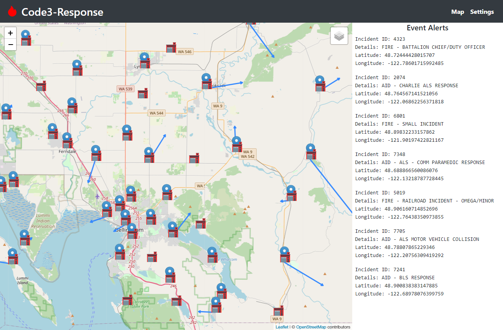
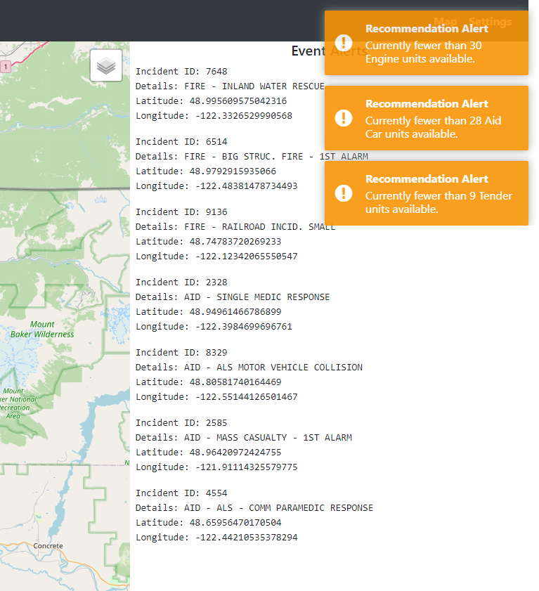

# Code3-Response: Situational Analysis Tool

```This is a team project developed alongside Levrum Data Technologies under NDA.```

### The foundation for a situational analysis tool used to evaluate, refine, and optimize strategies for dynamically repositioning fire and EMS resources for best coverage during volatile emergency incidents. Includes a rule engine, dispatch emulator, repositories, and API endpoints linked to a React frontend.

<br>



How often do you get to write code that could save lives? Working with Levrum Data Technologies, our team designed and built the foundation for an application meant to supply fire and emergency service departments with fast situational analysis.

Built upon what our team has developed, future iterations will be able to identify conditions which would necessitate a “move-up”. By tracking each unit’s status, location, and assignment, the software will recommend optimal relocations based on a department’s guidelines.



Our web-based application provides the location of status of apparatuses and stations as well as an indicator for which incident they are currently assigned to.

Additionally, the Event Alerts sidebar lists the seven most recent incidents in real-time. The details of each incident are listed along with any alerts that have been triggered according to the rules set in the program.

We have worked closely with the team at Levrum Data Technologies during the development process. Regularly scheduled meetings and requirements from their clients has shaped the direction of this application.

We are proud to have created the first iteration of this software that Levrum aims to add to their existing catalog of products.

## Our project is a three-tier web-based application of Model-View-Controller design.
<br>
<strong>.NET Core Backend</strong>

> Our backend contains the business logic used to coordinate asynchronous updates to the current situation. Within the backend is a Computer-Aided Dispatch emulator, which is intended to be replaced with each department’s own service. This CAD generates random incidents and assigns available units. The Oracle class acts as the manager as it listens for information coming from the CAD and updates its internal state table, which contains all necessary up-to-date environment information. Its rule library is checked for violations and any recommendation or alert is sent to the frontend via the API.

<strong><span>ASP.</span>NET Transport Layer</strong>

> Our API is built with multiple RESTful endpoints. The map is populated with the units and stations within the repositories and events are sent from the API to the frontend to be decoded into JSON format. These events are in turn shown on the right-hand side of the map, with the 7 most recent incidents displayed with their most important details.

<strong>React User Interface</strong>

> Our frontend consists of the React web application. This is used to access and display information from the transport layer. Stations and apparatuses are displayed at their given coordinates via unique markers and arrows indicate a unit’s assigned incident. The visibility of each layer of information can be turned on and off by the user.

<strong>Languages</strong>
* C#
* JavaScript
* YAML

<strong>Frameworks</strong>
* .NET Core
* <span>ASP.</span>NET Core
* React

<strong>Version Control</strong>
* Bitbucket

<strong>Major Libraries</strong>
* OpenStreetMap
* Leaflet
* React Router

<strong>Development Tools</strong>
* Visual Studio
* JetBrains Rider
* NuGet Package Manager
